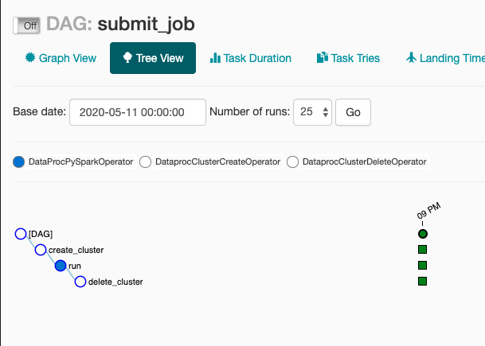
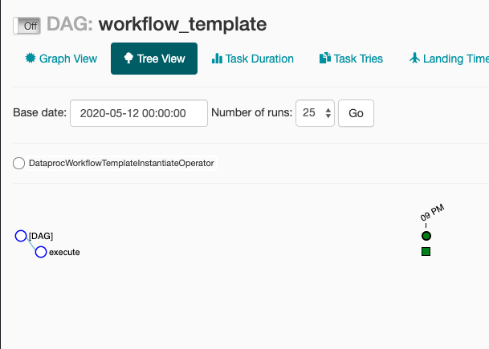

# AirflowDataprocExample
Using Apache Airflow for scheduling Cloud Dataproc Spark Jobs.

 

 

 

Airflow DAGs are in the folder ./dags/

**Airflow DataProc Operators:**
https://airflow.apache.org/docs/stable/_api/airflow/contrib/operators/dataproc_operator/index.html#module-airflow.contrib.operators.dataproc_operator

**Dataproc WorkflowTemplate:**
- Commands used to create the template are in ./commands.txt file.

